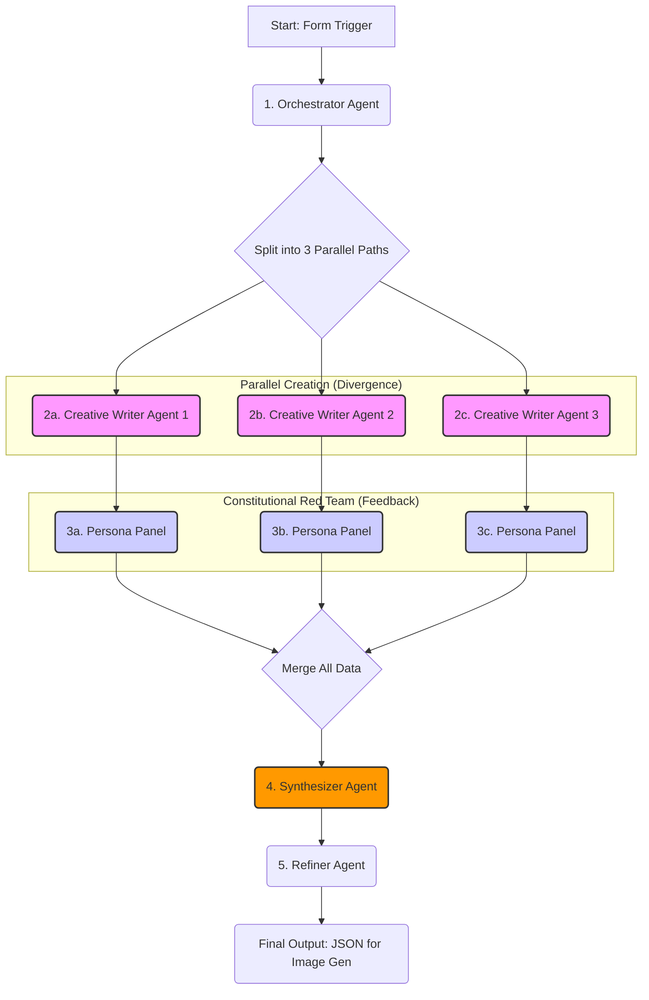

## Re-architecting Your n8n Workflow: A Multi-Agent Content Factory

Based on a deep analysis of Anthropic's multi-agent framework and your specific interest in the "customer persona analyzer," we can re-architect your n8n workflow from a linear assembly line into a sophisticated, parallel-processing "Content Generation Factory."

This new design introduces parallelism for creative diversity, robust feedback loops for quality assurance, and a clear separation of roles, making the entire process more powerful and scalable.

### **Conceptual Shift: From Assembly Line to Content Factory**

The original workflow is a **linear pipeline**: `Extract -> Draft -> Critique -> Refine`. This is effective but limiting. If the initial draft from the `Jr. Script Writer` is weak, the entire process suffers.

The new architecture is an **Orchestrator-Worker model with a parallel feedback loop**:

1.  **Orchestrator:** A master agent that defines the project, the required "experts" (worker agents), and the standards for success.
2.  **Parallel Workers (Divergence):** Multiple `Creative Writer` agents work in parallel to generate diverse initial concepts. This avoids putting all your eggs in one basket.
3.  **Parallel Critics (Convergence & Red Teaming):** A panel of `Persona Critic` agents (your "focus group") evaluates *each* concept in parallel. This is our **Constitutional Red Team**, stress-testing the content against specific personas and a core set of principles.
4.  **Synthesizer:** A new agent that analyzes all the creative concepts and the associated feedback to select the most promising one and provide a detailed rationale for its choice.
5.  **Refiner:** The final `Senior Writer` agent, which now has a much richer set of inputs (the winning concept, the critic feedback, and the synthesizer's analysis) to produce a polished final product.

-----

### **The Re-Architected n8n Workflow**

Here is a visual representation of the new workflow logic:



This structure would be implemented in n8n by having the `Orchestrator` output an array of tasks, which are then processed by the parallel branches.

-----

### **Node-by-Node Implementation Guide**

Here are the detailed prompts and configurations for the key agents in your new workflow.

#### **1. The `Orchestrator` Agent**

This agent replaces your initial `Topic Extractor`. It's responsible for high-level strategy and setting up the entire project.

  * **Role:** The project manager. It analyzes the source blog post and defines the core creative brief for the downstream agents.
  * **Model:** Use a fast and cost-effective model like **Gemini 2.5 Flash** or **Claude 3 Haiku**. Its job is task decomposition, not creative writing.
  * **Prompt:**
    ```prompt
    You are a Creative Director at a top-tier marketing agency specializing in healthcare. Your task is to analyze a blog post and generate a clear, actionable creative brief for your team of content creators.

    **Context:**
    - **Blog Post:** {{ $json['Blog Post'] }}
    - **Target Audience:** {{ $json['Target Audience'] }}`

    **Your Assignment:**
    1.  Read the blog post and identify 3 distinct, emotionally resonant angles that could be turned into social media carousels. These angles should NOT be simple summaries; they should be narrative themes.
    2.  For each angle, define a `creative_brief` that includes:
        - `angle_title`: A short, descriptive title for the angle (e.g., "The Guilt of Not Noticing Sooner").
        - `core_emotion`: The primary emotion this angle should evoke (e.g., "Anxious Relief," "Empathetic Concern").
        - `target_pain_point`: The specific problem this angle addresses for the target audience.
        - `key_takeaway`: The single message you want the audience to remember.

    **Output Format:**
    Your entire response must be a single, raw JSON array of objects. Each object represents one creative brief. Do not wrap the JSON in markdown fences.

    **Example Output:**
    [
      {
        "angle_title": "The Sunday Night Phone Call",
        "core_emotion": "Worry",
        "target_pain_point": "The anxiety of not knowing if your parent is okay when you're not there.",
        "key_takeaway": "Consistent, professional support can bring you peace of mind."
      },
      {
        "angle_title": "More Than Just a Helper",
        "core_emotion": "Hope",
        "target_pain_point": "The fear that a caregiver will be a stranger who just goes through the motions.",
        "key_takeaway": "The right caregiver can become a trusted companion for your parent."
      }
    ]
    ```

#### **2. The `Creative Writer` Agent (Run in Parallel)**

This agent replaces the `Jr. Script Writer`. You will run three instances of this in parallel, each receiving the same input from the `Orchestrator`. This encourages diverse outputs.

  * **Role:** A junior-to-mid-level copywriter whose job is to translate a creative brief into a compelling first draft.
  * **Model:** Again, a fast and creative model like **Gemini 2.5 Flash** or **Claude 3 Haiku** is perfect here. You want speed and creativity, not deep analysis.
  * **Prompt:**
    ```prompt
    You are a Junior Content Creator. Your task is to generate ONE emotionally-driven carousel post idea based on the provided Creative Brief. Your goal is to write in a simple, conversational, and human tone.

    **Creative Brief:**
    {{ JSON.stringify($json.creative_brief) }}

    **Your Assignment:**
    1.  Use a "Problem, Agitate, Solve" structure for the carousel slides.
    2.  The first slide must be a strong "Pattern Interrupt" hook.
    3.  Suggest authentic, user-generated-style visual ideas for each slide.
    4.  Your entire response must be a single, raw JSON object.

    **Output Format:**
    {
      "title": "{{ $json.creative_brief.angle_title }}",
      "target_pain_point": "{{ $json.creative_brief.target_pain_point }}",
      "key_emotion": "{{ $json.creative_brief.core_emotion }}",
      "slides": [
        {
          "slide_number": 1,
          "type": "hook",
          "text": "...",
          "visual_idea": "..."
        },
        {
          "slide_number": 2,
          "type": "agitate",
          "text": "...",
          "visual_idea": "..."
        },
        {
          "slide_number": 3,
          "type": "solve",
          "text": "...",
          "visual_idea": "..."
        },
        {
          "slide_number": 4,
          "type": "cta",
          "text": "...",
          "visual_idea": "..."
        }
      ]
    }
    ```

#### **3. The `Persona Critic` Panel (Your "Constitutional Red Team")**

This is the enhanced version of your `Adult Children ICP Analyzer`. Instead of one, you run two (or more) different persona critics in parallel for *each* creative draft. This is the heart of your quality assurance process.

  * **Role:** A simulated user who provides critical feedback based on their specific persona and a set of guiding principles (the "Constitution"). This is a **Red Teaming** exercise to find flaws in the content.

  * **Model:** Use a model with strong reasoning and instruction-following capabilities, like **GPT-4o**, **Claude 3 Sonnet**, or **Gemini 2.5 Pro**. It needs to embody a persona *and* apply a set of rules.

  * **The Content Constitution:** Before the prompt, you define the rules.

    ```
    **Content Constitution - Guiding Principles:**
    1.  **Dignity First:** Never portray seniors as helpless, frail, or a burden. Focus on their continued strength, wisdom, and desire for independence. The solution (care) should be a tool that *enables* their independence, not a sign of its loss.
    2.  **Empathy, Not Pity:** The tone must be empathetic to the challenges of both the adult child and the senior. It should feel like a supportive friend, not a clinical provider. Avoid language that sounds condescending or overly sentimental.
    3.  **Show, Don't Tell:** Do not use vague marketing platitudes like "peace of mind" or "quality care." Instead, describe the *outcome* of that care (e.g., "So you can go back to just being their daughter, not their project manager.").
    4.  **Authenticity is Key:** The language and visuals must feel real and avoid the look of staged stock photography or corporate jargon.
    5.  **No Medical Claims:** Do not make any claims about treating, curing, or diagnosing medical conditions. The service is non-medical home care.
    ```

  * **`Persona Critic` Prompt (Example: The Skeptical Adult Daughter):**

    ```prompt
    You are a simulated member of a focus group. Your persona is "Sarah," a 52-year-old marketing manager from just outside Boston. You are pragmatic, skeptical of advertising, and deeply protective of your 80-year-old father who is fiercely independent. You are stressed, short on time, and feel guilty that you can't be there more often.

    **Your Task:**
    You will be shown a concept for a social media carousel. Your job is to critique it ruthlessly based on your persona and the **Content Constitution** provided below. You are a "Red Teamer" looking for any reason this content might fail to connect with you or, worse, offend you.

    **Content Constitution:**
    (Insert the Content Constitution from above)

    **Carousel Concept to Critique:**
    {{ JSON.stringify($json.carousel_concept) }}

    **Your Analysis:**
    Provide your feedback in a raw JSON object with the following fields:

    - `overall_score`: Your gut reaction score from 1 (terrible) to 10 (perfect).
    - `is_constitutional`: A boolean (true/false) indicating if the concept adheres to the Content Constitution.
    - `red_team_flags`: An array of strings identifying specific weaknesses, potential misinterpretations, or things that feel "off" or cliché.
    - `positive_feedback`: What, if anything, resonated with you?
    - `suggested_improvements`: Concrete suggestions on how to make this concept more powerful and convincing *for you*.

    **Example Output:**
    {
      "overall_score": 4,
      "is_constitutional": false,
      "red_team_flags": [
        "The phrase 'giving them a hand with daily stuff' sounds condescending. My dad doesn't need a 'hand.'",
        "The visual idea for the 'solve' slide is still too generic. 'Happy senior' means nothing to me.",
        "Violates Constitution Principle #1: It subtly implies my dad is helpless."
      ],
      "positive_feedback": "The hook on the first slide about the missed calls was relatable and got my attention.",
      "suggested_improvements": "Rephrase the 'solve' slide to focus on my dad reclaiming something he loves, like his gardening, not just 'getting help.' Show him covered in dirt and smiling, with the caregiver in the background, barely visible."
    }
    ```

#### **4. The `Synthesizer` Agent**

This is a new, crucial agent that acts as the bridge between the creative and refinement stages.

  * **Role:** An executive producer who reviews all the creative drafts and their associated critiques to decide which concept has the most potential to become a successful campaign.
  * **Model:** You need your most powerful and analytical model here. **GPT-4o** or **Claude 3 Opus** are the best choices. This agent's reasoning is critical.
  * **Prompt:**
    ```prompt
    You are a Senior Content Strategist. Your task is to analyze a set of creative concepts and the feedback they received from a "Constitutional Red Team" panel of personas. Your goal is to select the single best concept to move forward with and provide a clear, strategic rationale for your decision.

    **Input Data (as a JSON array):**
    {{ JSON.stringify($input.all()) }}
    *This will contain each creative draft paired with feedback from multiple personas.*

    **Your Assignment:**
    1.  Review all the concepts and their feedback.
    2.  Identify the concept that is the most promising, even if it's not perfect yet. Look for the one with the strongest emotional core and the most potential to be refined into a powerful piece of content.
    3.  Provide a detailed analysis explaining your choice. Reference the specific feedback from the personas to justify your decision.
    4.  Create a final "Refinement Brief" for the Senior Writer, outlining the winning concept and a bulleted list of mandatory changes based on the persona feedback.

    **Output Format:**
    Your entire response must be a single, raw JSON object.

    {
      "winning_concept_title": "...",
      "strategic_rationale": "I chose this concept because, while the execution was flawed, its core emotional hook around 'The Sunday Night Phone Call' resonated most strongly with all personas. The 'Skeptical Daughter' persona flagged the copy as condescending, but the core idea was validated. This is easier to fix than a weak core concept.",
      "refinement_brief": {
        "original_concept": { ... }, // The full JSON of the winning concept
        "mandatory_revisions": [
          "Rewrite the text for slide 2 to be from the daughter's perspective, focusing on her feeling of worry, not the parent's failings.",
          "Change the visual idea for slide 3 to be hyper-specific, as suggested by the 'Skeptical Daughter' persona: focus on the parent's reclaimed hobby.",
          "Ensure all copy adheres strictly to the Content Constitution, especially principles #1 and #3."
        ]
      }
    }
    ```

#### **5. The `Refiner` (Senior Writer) Agent**

This is your existing `Sr. Script Writer`, but now armed with much more powerful and structured input.

  * **Role:** A master wordsmith who takes a validated concept and polishes it to perfection.
  * **Model:** Use a high-quality model like **GPT-4o**, **Claude 3 Opus**, or **Gemini 2.5 Pro**.
  * **Prompt:**
    ```prompt
    You are a Senior Content Strategist and a master copywriter. Your task is to take a winning creative concept and a specific "Refinement Brief" and produce the final, production-ready carousel content.

    **Context & Data:**
    - **Refinement Brief:** `{{ $json.refinement_brief }}`
    - **Target Audience:** `{{ $('On form submission').item.json['Target Audience'] }}`
    - **Content Constitution:** (Insert the full constitution here)

    **Your Assignment:**
    1.  Execute all the `mandatory_revisions` from the brief.
    2.  Refine the copy to embody a "Wise & Empathetic Guide" archetype.
    3.  Elevate the `visual_idea` for each slide to be more specific and inspiring for a graphic designer.
    4.  Create detailed `design_notes` and a `strategic_rationale` for the final output.
    5.  Ensure the final output is a single, raw JSON object, starting with `{` and ending with `}`.

    *(The rest of the output format can remain the same as your original Sr. Script Writer prompt).*
    ```

This re-architected workflow is a significant upgrade. It leverages the principles of multi-agent systems to create a more resilient, creative, and quality-focused process, with your "customer persona analyzer" transformed into a powerful, strategic **Constitutional Red Team** at the very heart of the operation.